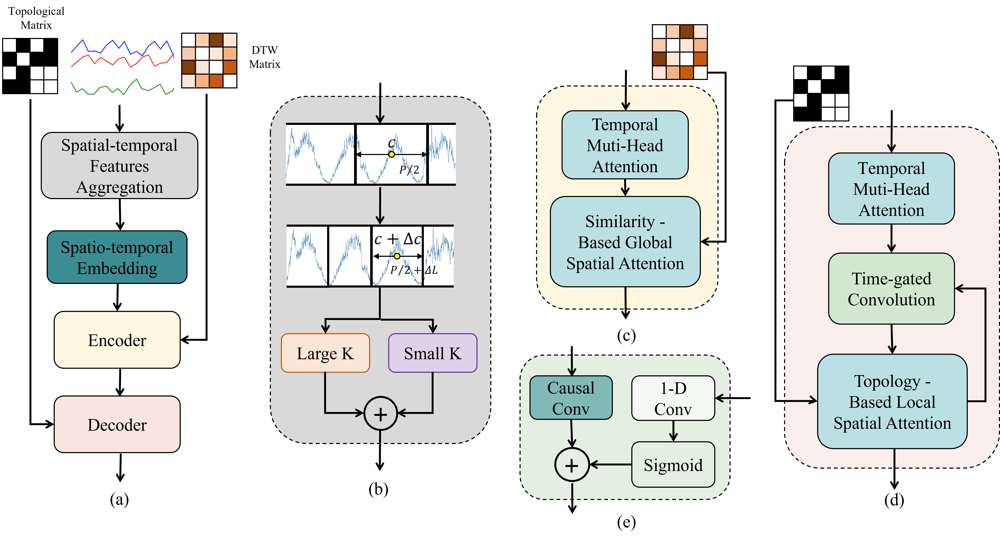

[](https://peerj.com/articles/cs-3793/)
[](https://doi.org/10.7717/peerj-cs.3793)
[](https://www.python.org/downloads/release/python-392/)
[](https://pytorch.org/)
[](https://creativecommons.org/licenses/by/4.0/)

Official PyTorch implementation of our paper:

**DTG-LKNet: dual spatio-temporal graphs and large-kernel convolutions network for traffic prediction**  
*PeerJ Computer Science*, 2026

[Paper](https://doi.org/10.7717/peerj-cs.3793) ·
[Zenodo](https://doi.org/10.5281/zenodo.18934032)

DTG-LKNet is a spatio-temporal forecasting architecture designed to capture
**long-range temporal dependencies** and **dynamic spatial correlations**
in traffic networks.

## Highlights
- **Deformable Patch Sampling (DPS)** adaptively adjusts temporal sampling positions and spans instead of relying on fixed temporal patches.
- **Large-kernel convolution** expands the effective temporal receptive field for long-range dependency modeling.
- **Dual spatio-temporal graphs** combine functional similarity and physical road-network topology to capture both global and local spatial dependencies.
- Evaluated on **PEMS03, PEMS04, and PEMS07** against 20 baseline models.
## Results

Performance comparison on PEMS03, PEMS04, and PEMS07:

<p align="center">
  
</p>

## Requirements

python.

torch-gpu.

## Data Preparation

Step1: Download datasets([PEMS03](https://github.com/guoshnBJTU/ASTGNN/tree/main/data/PEMS03),[PEMS04](https://github.com/guoshnBJTU/ASTGNN/tree/main/data/PEMS04),[PEMS07](https://github.com/guoshnBJTU/ASTGNN/tree/main/data/PEMS07)).

Step2: Process raw data

```bash
python PrepareData.py
```

Step3: Generate DTW data

```bash
python create_dtw.py
```

## Train

```bash
python run.py
```

### Config

You can modify the parameters in the [configurations](/configurations/).

### Notes

- Running PEMS07 may require approximately **40 GB of GPU memory** with the current configuration.
- If `PrepareData.py` runs out of system memory, consider increasing virtual memory or reducing memory usage during preprocessing.
### ERF Visualization for Convolution Layers

> Figure A:  Standard TCN effective‑receptive‑field heatmap for traffic prediction. Darker color represents higher contribution weight for prediction.


> Figure B: large‑kernel convolution effective‑receptive‑field heatmap for traffic prediction.

`erf_conv.py` computes and visualizes the Effective Receptive Field (ERF)
of convolution layers through gradient backpropagation.
The script aggregates ERF results across multiple test samples and visualizes
how different time steps and nodes contribute to predictions for the target node.
The number of samples, target layer, and visualization scope can be adjusted as needed.
### Cite
If you find the paper useful, please cite as following:

```bibtex
@article{cao2026dtg,
  title={DTG-LKNet: dual spatio-temporal graphs and large-kernel convolutions network for traffic prediction},
  author={Cao, Jiahao and Tian, Yuan and Long, YangSheng and Wang, Peng and Xiao, Tong and Ye, Peng and Teng, Guoqing},
  journal={PeerJ Computer Science},
  volume={12},
  pages={e3793},
  year={2026},
  doi={10.7717/peerj-cs.3793}
}
```
Thanks to the following open-source repositories for their valuable support in this work:

- [LCDFormer](https://github.com/NanakiC/LCDFormer)
- [ASTGNN](https://github.com/guoshnBJTU/ASTGNN)
- [ConvTimeNet](https://github.com/Mingyue-Cheng/ConvTimeNet)
- [PDFormer](https://github.com/BUAABIGSCity/PDFormer)
- [RepLKNet-pytorch](https://github.com/DingXiaoH/RepLKNet-pytorch)

